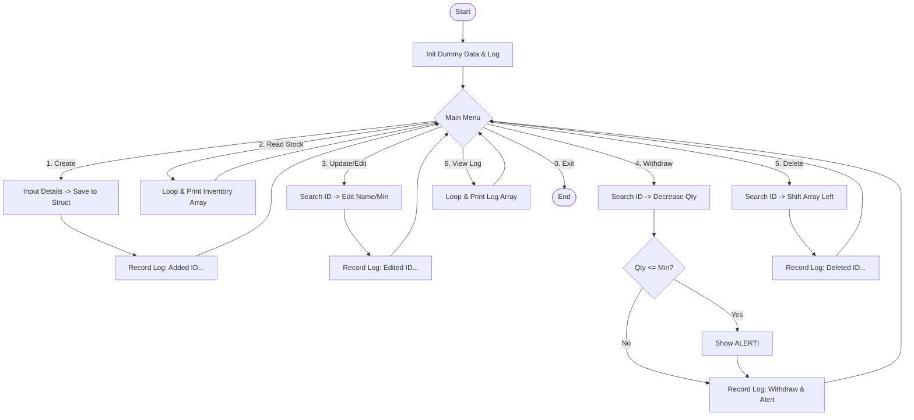

นี่คือเอกสารประกอบโครงงานฉบับสมบูรณ์สำหรับ **"ระบบบริหารจัดการสต็อกอะไหล่พร้อมระบบบันทึกประวัติ (Advanced Spare Parts Inventory with CRUD & Audit Log)"** ครับ

ผมได้รวมโค้ดเวอร์ชันล่าสุดที่ **แก้บั๊ก Infinite Loop (ลูปนรก)** และรวมฟีเจอร์ **CRUD + Log** ไว้ให้แล้ว สามารถนำเนื้อหานี้ไปลงเอกสารรายงานได้เลยครับ

---

# ชื่อโครงงาน: ระบบบริหารจัดการสต็อกอะไหล่และบันทึกประวัติการทำงาน (Spare Parts Inventory System with CRUD & Log)

## 1. ที่มาและความสำคัญของปัญหา

ในกระบวนการซ่อมบำรุงและผลิตในโรงงานอุตสาหกรรม การบริหารจัดการอะไหล่ (Spare Parts) มีความสำคัญอย่างยิ่ง ปัญหาที่พบบ่อยคือ "ข้อมูลไม่เป็นปัจจุบัน" และ "ไม่สามารถตรวจสอบย้อนหลังได้" ว่าใครเป็นคนเบิกของ หรือแก้ไขจำนวนเมื่อไหร่ การใช้เพียงการจดบันทึกใส่กระดาษทำให้เกิดความผิดพลาด (Human Error) และเมื่อของหายหรือจำนวนไม่ตรง ก็ไม่สามารถหาสาเหตุได้ ระบบดิจิทัลที่สามารถเพิ่ม ลบ แก้ไข และบันทึกประวัติ (Log) จึงเป็นสิ่งจำเป็นเพื่อความโปร่งใสและแม่นยำ

## 2. วัตถุประสงค์ของการวิจัย

1. เพื่อพัฒนาโปรแกรมบริหารจัดการสต็อกที่รองรับฟังก์ชันพื้นฐานครบถ้วน (CRUD: Create, Read, Update, Delete)
2. เพื่อสร้างระบบบันทึกประวัติการทำงาน (Audit Trail/Log) สำหรับตรวจสอบความถูกต้องย้อนหลัง
3. เพื่อป้องกันปัญหาข้อมูลผิดพลาดจากการป้อนข้อมูลของผู้ใช้งาน (Input Validation)

## 3. ประโยชน์ที่คาดว่าจะได้รับ

1. สามารถตรวจสอบจำนวนสินค้าคงเหลือได้อย่างรวดเร็วและแม่นยำ
2. มีหลักฐาน (Log) ยืนยันทุกธุรกรรมการเบิกจ่ายหรือแก้ไขข้อมูล
3. ลดความผิดพลาดจากการทำงานซ้ำซ้อนและการสูญหายของข้อมูล

## 4. ขอบเขตของงานวิจัย

* **ภาษาที่ใช้:** C Programming Language (Standard C)
* **เครื่องมือพัฒนา:** OnlineGDB Compiler
* **ฟังก์ชันหลัก:**
* **C**reate: เพิ่มรายชื่ออะไหล่ใหม่ (Auto ID)
* **R**ead: แสดงรายการอะไหล่ และ แสดงประวัติการทำงาน (Log History)
* **U**pdate: แก้ไขรายละเอียดอะไหล่ และ ตัดสต็อก (Withdraw)
* **D**elete: ลบรายชื่ออะไหล่ออกจากระบบ


* **ข้อจำกัด:** ข้อมูลจะถูกเก็บในหน่วยความจำชั่วคราว (RAM Array) ไม่มีการบันทึกเป็นไฟล์ถาวรในเวอร์ชันนี้

## 5. ขั้นตอนการดำเนินงาน

1. **Requirement Analysis:** วิเคราะห์ความต้องการระบบ CRUD และ Log
2. **Design:** ออกแบบโครงสร้างข้อมูล (Struct) สำหรับสินค้า และ Array สำหรับเก็บข้อความ Log
3. **Implementation:** เขียนโค้ดภาษา C โดยแบ่งเป็นฟังก์ชันย่อย และใส่ระบบป้องกัน Input Error
4. **Testing:** ทดสอบการ เพิ่ม ลบ แก้ไข และดู Log ว่าบันทึกถูกต้องตามเวลาจริงหรือไม่
5. **Documentation:** จัดทำเอกสารและคู่มือการใช้งาน

---

## 6. โครงสร้างและรายละเอียดฟังก์ชั่น (Function Structure & Details)

### 6.1 โครงสร้างข้อมูล (Data Structures)
```c
struct Part {
    int id;           // รหัสสินค้า (Auto-increment)
    char name[50];    // ชื่อสินค้า/อะไหล่
    int quantity;     // จำนวนคงเหลือ
    int min_level;    // จำนวนขั้นต่ำที่ต้องมีในสต็อก
};
```

### 6.2 ตัวแปรส่วนกลาง (Global Variables)
- `struct Part inventory[100]`: เก็บข้อมูลสินค้าสูงสุด 100 รายการ
- `int count`: ตัวนับจำนวนสินค้าปัจจุบันในระบบ
- `char transactionLog[100][200]`: เก็บประวัติการทำงาน (Log History)
- `int logCount`: ตัวนับจำนวน Log ที่บันทึกไว้

### 6.3 ฟังก์ชั่นช่วยงาน (Helper Functions)

#### 6.3.1 `void recordLog(char *action, char *type)`
**วัตถุประสงค์:** บันทึกประวัติการทำงานพร้อมเวลาที่แม่นยำ

**การทำงาน:**
1. ดึงเวลาปัจจุบันจากระบบโดยใช้ `time()` และ `strftime()`
2. กำหนดสีและไอคอนตามประเภทกิจกรรม:
   - `ADD` (เพิ่ม): สีเขียว `[+]`
   - `DEL` (ลบ): สีแดง `[-]`
   - `EDIT` (แก้ไข): สีเหลือง `[*]`
   - `ALERT` (แจ้งเตือน): สีแดง `[!]`
   - `INFO` (ข้อมูลทั่วไป): สีฟ้า `[i]`
3. จัดรูปแบบข้อความให้อยู่ในรูปตาราง
4. เก็บลงใน Array `transactionLog[]`

**ตัวอย่างการใช้งาน:**
```c
recordLog("Added 'Bearing_6201' (Qty: 50, Min: 10)", "ADD");
```

#### 6.3.2 `void printLine(int width)`
**วัตถุประสงค์:** วาดเส้นคั่นตารางเพื่อความสวยงาม

**การทำงาน:** รับพารามิเตอร์ความกว้าง แล้วพิมพ์เครื่องหมาย `+` และ `-` ตามความยาวที่กำหนด

### 6.4 ฟังก์ชั่น CRUD หลัก (Main CRUD Functions)

#### 6.4.1 `void addPart()` - [C]reate (เพิ่มสินค้าใหม่)
**วัตถุประสงค์:** เพิ่มรายการอะไหล่ใหม่เข้าสู่ระบบ

**ขั้นตอนการทำงาน:**
1. **Auto ID Generation:** สร้างรหัสสินค้าอัตโนมัติ
   - หากไม่มีสินค้าในระบบ: เริ่มที่ ID = 1
   - หากมีสินค้าแล้ว: ใช้ ID สุดท้าย + 1
2. **รับข้อมูลจากผู้ใช้:**
   - ชื่อสินค้า (Part Name)
   - จำนวน (Quantity)
   - ระดับขั้นต่ำ (Min Safety Level)
3. **บันทึกข้อมูล:** เก็บลง Array `inventory[]`
4. **บันทึก Log:** เรียก `recordLog()` เพื่อบันทึกประวัติ
5. **เพิ่มตัวนับ:** เพิ่ม `count++`

**ข้อดี:**
- ไม่ต้องจำ ID ล่าสุด (Auto-increment)
- มีการยืนยันผลสำเร็จด้วยสีเขียว
- บันทึกประวัติทันที

#### 6.4.2 `void displayInventory()` - [R]ead (แสดงรายการสินค้า)
**วัตถุประสงค์:** แสดงรายการสินค้าทั้งหมดในรูปแบบตาราง

**ขั้นตอนการทำงาน:**
1. **สร้างหัวตาราง:** แสดง Header ด้วยคอลัมน์ ID, PART NAME, QTY, MIN, STATUS
2. **วนลูปแสดงข้อมูล:** ใช้ `for loop` อ่านจาก `inventory[]`
3. **ตรวจสอบสถานะ:** เปรียบเทียบ `quantity <= min_level`
   - หากน้อยกว่า: แสดง "LOW STOCK!" สีแดง
   - หากปกติ: แสดง "OK" สีเขียว
4. **จัดรูปแบบตาราง:** ใช้ `%-20s` สำหรับจัดตำแหน่งข้อความ

**ผลลัพธ์ที่ได้:**
```
+-----+----------------------+----------+----------+----------------+
| ID  | PART NAME            | QTY      | MIN      | STATUS         |
+-----+----------------------+----------+----------+----------------+
| 1   | Bearing_6201         | 50       | 10       | OK             |
| 2   | Belt_Fan_A1          | 5        | 15       | LOW STOCK!     |
+-----+----------------------+----------+----------+----------------+
```

#### 6.4.3 `void viewLogHistory()` - [R]ead Log (แสดงประวัติ)
**วัตถุประสงค์:** แสดงประวัติการทำงานทั้งหมดในรูปแบบตาราง

**ขั้นตอนการทำงาน:**
1. **สร้างหัวตาราง:** TIMESTAMP | TYPE | ACTION DETAILS
2. **ตรวจสอบข้อมูล:** หากไม่มี Log แสดง "No history found"
3. **แสดง Log:** วนลูปพิมพ์จาก Array `transactionLog[]`
4. **รักษารูปแบบ:** แต่ละ Log มีสีและไอคอนตามประเภท

#### 6.4.4 `void editPart()` - [U]pdate (แก้ไขข้อมูลสินค้า)
**วัตถุประสงค์:** แก้ไขชื่อและระดับขั้นต่ำของสินค้า

**ขั้นตอนการทำงาน:**
1. **รับ ID:** ผู้ใช้ป้อนรหัสสินค้าที่ต้องการแก้ไข
2. **ค้นหาสินค้า:** วนลูปหาใน Array `inventory[]`
3. **แก้ไขข้อมูล:** หากพบ ให้แก้ไข `name` และ `min_level`
4. **บันทึก Log:** เรียก `recordLog()` ประเภท "EDIT"
5. **จัดการข้อผิดพลาด:** หากไม่พบ ID แสดงข้อความแจ้งเตือน

**Input Validation:** มีการตรวจสอบ `scanf()` เพื่อป้องกันการ Input ผิดรูปแบบ

#### 6.4.5 `void withdrawPart()` - [U]pdate Transaction (เบิกสินค้า)
**วัตถุประสงค์:** ลดจำนวนสินค้าเมื่อมีการเบิกใช้งาน

**ขั้นตอนการทำงาน:**
1. **รับข้อมูล:** ID สินค้าและจำนวนที่ต้องการเบิก
2. **ค้นหาสินค้า:** หาสินค้าจาก ID
3. **ตรวจสอบจำนวน:** เปรียบเทียบว่าจำนวนที่เบิก ≤ จำนวนคงเหลือ
4. **ดำเนินการเบิก:** หากเพียงพอ ลด `quantity` ลง
5. **ตรวจสอบแจ้งเตือน:** หาก `quantity <= min_level` แสดงคำเตือน "LOW STOCK!"
6. **บันทึก Log:** เรียก `recordLog()` สองครั้ง
   - ครั้งที่ 1: บันทึกการเบิก (WITHDRAW)
   - ครั้งที่ 2: บันทึกการแจ้งเตือน (ALERT) หากจำเป็น

**ฟีเจอร์พิเศษ:**
- แสดงจำนวนคงเหลือหลังเบิก
- แจ้งเตือนอัตโนมัติเมื่อสินค้าใกล้หมด
- ป้องกันการเบิกเกินจำนวน

#### 6.4.6 `void deletePart()` - [D]elete (ลบสินค้า)
**วัตถุประสงค์:** ลบรายการสินค้าออกจากระบบอย่างถาวร

**ขั้นตอนการทำงาน:**
1. **รับ ID:** ผู้ใช้ป้อนรหัสสินค้าที่ต้องการลบ
2. **ค้นหาสินค้า:** หาตำแหน่งใน Array
3. **เก็บชื่อ:** บันทึกชื่อสินค้าก่อนลบ (สำหรับ Log)
4. **Shift Array:** ย้ายข้อมูลทั้งหมดข้างหลังมาข้างหน้า 1 ตำแหน่ง
   ```c
   for(int j = i; j < count - 1; j++) {
       inventory[j] = inventory[j+1];
   }
   ```
5. **ลดตัวนับ:** `count--`
6. **บันทึก Log:** เรียก `recordLog()` ประเภท "DEL"

**ข้อดี:**
- ไม่เหลือช่องว่างใน Array
- รักษาลำดับของข้อมูล
- บันทึกประวัติการลบ

### 6.5 ฟังก์ชั่นหลัก (Main Function)
**วัตถุประสงค์:** ควบคุมการทำงานทั้งหมดของโปรแกรม

**ขั้นตอนการทำงาน:**
1. **เริ่มต้นข้อมูล:** สร้างข้อมูลตัวอย่าง (Dummy Data)
   - Bearing_6201: จำนวน 50, ขั้นต่ำ 10
   - Belt_Fan_A1: จำนวน 5, ขั้นต่ำ 15
2. **แสดงเมนู:** ใช้ `do-while` loop แสดงตัวเลือก 7 รายการ
3. **รับคำสั่ง:** ใช้ `scanf()` พร้อม Input Validation
4. **ประมวลผล:** ใช้ `switch-case` เรียกฟังก์ชั่นที่ตรงกัน
5. **ป้องกันข้อผิดพลาด:** หาก `scanf()` ล้มเหลว จะล้างบัฟเฟอร์และตั้ง `choice = -1`

**Input Validation Logic:**
```c
if (scanf("%d", &choice) != 1) {
    while(getchar() != '\n');  // ล้างบัฟเฟอร์
    choice = -1;              // บังคับให้แสดง Error
}
```

## 7. ผังงาน (Flowchart)



---

## 7. การเขียนโค้ด (Source Code)

*หมายเหตุ: โค้ดนี้รวมการแก้ปัญหา Input Error (ลูปนรก) ไว้ในฟังก์ชัน `main` แล้ว*

```c
#include <stdio.h>
#include <string.h>
#include <time.h> // ใช้สำหรับดึงเวลาปัจจุบัน

// --- 1. ตั้งค่าสีและรูปแบบ (ANSI Colors) ---
#define COLOR_RESET   "\x1b[0m"
#define COLOR_RED     "\x1b[31m"     // สีแดง (ลบ/แจ้งเตือน)
#define COLOR_GREEN   "\x1b[32m"     // สีเขียว (เพิ่ม)
#define COLOR_YELLOW  "\x1b[33m"     // สีเหลือง (แก้ไข)
#define COLOR_BLUE    "\x1b[34m"     // สีน้ำเงิน (Header)
#define COLOR_CYAN    "\x1b[36m"     // สีฟ้า (Info)
#define COLOR_BOLD    "\x1b[1m"      // ตัวหนา

// --- 2. โครงสร้างข้อมูล (Data Structures) ---
struct Part {
    int id;
    char name[50];
    int quantity;
    int min_level;
};

// Global Variables
struct Part inventory[100];     // เก็บสินค้าสูงสุด 100 รายการ
int count = 0;                  // ตัวนับสินค้า
char transactionLog[100][200];  // เก็บประวัติ (ขยายขนาดบรรทัดเพื่อให้ใส่ Code สีได้พอ)
int logCount = 0;               // ตัวนับประวัติ

// --- 3. Helper Functions (ฟังก์ชันช่วยงาน) ---

// ฟังก์ชันบันทึก Log แบบสวยงาม (Auto-Format Table)
void recordLog(char *action, char *type) {
    time_t now;
    time(&now);
    struct tm *local = localtime(&now);
    char time_str[30];
    
    // ดึงเวลาปัจจุบัน Format: YYYY-MM-DD HH:MM:SS
    strftime(time_str, sizeof(time_str), "%Y-%m-%d %H:%M:%S", local);

    // เลือกสีตามประเภท (Type)
    char color[15];
    char typeIcon[10]; 
    
    if (strcmp(type, "ADD") == 0) { 
        strcpy(color, COLOR_GREEN); strcpy(typeIcon, "[+]"); 
    } else if (strcmp(type, "DEL") == 0) { 
        strcpy(color, COLOR_RED); strcpy(typeIcon, "[-]");
    } else if (strcmp(type, "EDIT") == 0) { 
        strcpy(color, COLOR_YELLOW); strcpy(typeIcon, "[*]");
    } else if (strcmp(type, "ALERT") == 0) { 
        strcpy(color, COLOR_RED); strcpy(typeIcon, "[!]");
    } else { 
        strcpy(color, COLOR_CYAN); strcpy(typeIcon, "[i]");
    }

    // จัด Format ลงในตาราง: | TIMESTAMP | TYPE | DETAILS |
    sprintf(transactionLog[logCount], 
            "| %s | %s%s %-6s %s | %-55s |", 
            time_str, color, COLOR_BOLD, type, COLOR_RESET, action);
            
    logCount++;
}

// ฟังก์ชันวาดเส้นคั่นตาราง (เพื่อความสวยงามและเรียกใช้ง่าย)
void printLine(int width) {
    printf("+");
    for(int i=0; i<width; i++) printf("-");
    printf("+\n");
}

// --- 4. CRUD Functions ---

// [C]reate: เพิ่มสินค้า
void addPart() {
    char logMsg[100];
    printf("\n%s--- [ Create New Part ] ---%s\n", COLOR_GREEN, COLOR_RESET);
    
    int newID = (count == 0) ? 1 : inventory[count-1].id + 1; // Auto ID
    inventory[count].id = newID;
    
    printf(" Enter Part Name      : ");
    scanf("%s", inventory[count].name);
    printf(" Enter Quantity       : ");
    scanf("%d", &inventory[count].quantity);
    printf(" Enter Min Safety Lvl : ");
    scanf("%d", &inventory[count].min_level);
    
    printf("%s >> Success! Added ID: %d%s\n", COLOR_GREEN, newID, COLOR_RESET);
    
    sprintf(logMsg, "Added '%s' (Qty: %d, Min: %d)", inventory[count].name, inventory[count].quantity, inventory[count].min_level);
    recordLog(logMsg, "ADD"); // ส่ง Type ADD
    
    count++;
}

// [R]ead: แสดงสินค้า (ตารางสวยงาม)
void displayInventory() {
    printf("\n%s--- Current Inventory Stock ---%s\n", COLOR_BLUE, COLOR_RESET);
    
    // Header Table
    printf("+-----+----------------------+----------+----------+----------------+\n");
    printf("| %-3s | %-20s | %-8s | %-8s | %-14s |\n", "ID", "PART NAME", "QTY", "MIN", "STATUS");
    printf("+-----+----------------------+----------+----------+----------------+\n");
    
    for(int i = 0; i < count; i++) {
        char status[50];
        
        // Check Status logic
        if(inventory[i].quantity <= inventory[i].min_level) {
            sprintf(status, "%s%sLOW STOCK!%s", COLOR_RED, COLOR_BOLD, COLOR_RESET);
        } else {
            sprintf(status, "%sOK%s", COLOR_GREEN, COLOR_RESET);
        }
        
        // Print Row
        // หมายเหตุ: %-20s คือจองพื้นที่ 20 ตัวอักษรและชิดซ้าย
        printf("| %-3d | %-20s | %-8d | %-8d | %-23s |\n", 
               inventory[i].id, inventory[i].name, inventory[i].quantity, inventory[i].min_level, status);
    }
    printf("+-----+----------------------+----------+----------+----------------+\n");
}

// [R]ead Log: แสดงประวัติ (ตารางสวยงาม)
void viewLogHistory() {
    printf("\n%s--- System Audit Trail (Log) ---%s\n", COLOR_CYAN, COLOR_RESET);
    
    printf("+---------------------+------------+---------------------------------------------------------+\n");
    printf("| %-19s | %-10s | %-55s |\n", "TIMESTAMP", "TYPE", "ACTION DETAILS");
    printf("+---------------------+------------+---------------------------------------------------------+\n");
    
    if(logCount == 0) {
        printf("| %-88s |\n", " No history found.");
    } else {
        for(int i = 0; i < logCount; i++) {
            printf("%s\n", transactionLog[i]);
        }
    }
    printf("+---------------------+------------+---------------------------------------------------------+\n");
}

// [U]pdate: แก้ไขข้อมูล
void editPart() {
    int id, found = 0;
    char logMsg[100];
    
    printf("\n%s--- [ Edit Part Details ] ---%s\n", COLOR_YELLOW, COLOR_RESET);
    printf(" Enter ID to edit: ");
    if(scanf("%d", &id) != 1) { while(getchar() != '\n'); return; }
    
    for(int i = 0; i < count; i++) {
        if(inventory[i].id == id) {
            found = 1;
            printf(" Editing ID %d (%s)...\n", id, inventory[i].name);
            printf(" Enter New Name      : ");
            scanf("%s", inventory[i].name);
            printf(" Enter New Min Level : ");
            scanf("%d", &inventory[i].min_level);
            
            printf("%s >> Update Successful!%s\n", COLOR_YELLOW, COLOR_RESET);
            
            sprintf(logMsg, "Updated ID %d. New Name: %s, Min: %d", id, inventory[i].name, inventory[i].min_level);
            recordLog(logMsg, "EDIT");
            break;
        }
    }
    if(!found) printf(" %sError: ID not found.%s\n", COLOR_RED, COLOR_RESET);
}

// [U]pdate Transaction: เบิกของ
void withdrawPart() {
    int id, qty, found = 0;
    char logMsg[100];
    
    printf("\n%s--- [ Withdraw / Cut Stock ] ---%s\n", COLOR_BLUE, COLOR_RESET);
    printf(" Enter ID: ");
    if(scanf("%d", &id) != 1) { while(getchar() != '\n'); return; }
    
    for(int i = 0; i < count; i++) {
        if(inventory[i].id == id) {
            found = 1;
            printf(" Current: %d. Withdraw Amount: ", inventory[i].quantity);
            scanf("%d", &qty);
            
            if(qty > inventory[i].quantity) {
                printf(" %sError: Not enough stock!%s\n", COLOR_RED, COLOR_RESET);
            } else {
                inventory[i].quantity -= qty;
                printf("%s >> Withdraw Done. Remaining: %d%s\n", COLOR_GREEN, inventory[i].quantity, COLOR_RESET);
                
                sprintf(logMsg, "Withdraw ID %d (%s) -%d pcs. Bal: %d", id, inventory[i].name, qty, inventory[i].quantity);
                recordLog(logMsg, "WITHDRAW"); // ใช้ Type ทั่วไป หรือสร้างใหม่ก็ได้

                // Check Min Level
                if(inventory[i].quantity <= inventory[i].min_level) {
                    printf("\n%s [!!! WARNING !!!] Stock is below Min Level!%s\n", COLOR_RED, COLOR_RESET);
                    sprintf(logMsg, "ALERT! Low Stock on ID %d (%s)", id, inventory[i].name);
                    recordLog(logMsg, "ALERT"); // แจ้งเตือนสีแดง
                }
            }
            break;
        }
    }
    if(!found) printf(" %sError: ID not found.%s\n", COLOR_RED, COLOR_RESET);
}

// [D]elete: ลบสินค้า
void deletePart() {
    int id, found = 0;
    char logMsg[100];
    
    printf("\n%s--- [ Delete Part ] ---%s\n", COLOR_RED, COLOR_RESET);
    printf(" Enter ID to DELETE: ");
    if(scanf("%d", &id) != 1) { while(getchar() != '\n'); return; }
    
    for(int i = 0; i < count; i++) {
        if(inventory[i].id == id) {
            found = 1;
            char deletedName[50];
            strcpy(deletedName, inventory[i].name);
            
            // Shift Array
            for(int j = i; j < count - 1; j++) {
                inventory[j] = inventory[j+1];
            }
            count--; 
            
            printf("%s >> Deleted ID %d (%s) successfully.%s\n", COLOR_RED, id, deletedName, COLOR_RESET);
            
            sprintf(logMsg, "Deleted Part ID %d (%s)", id, deletedName);
            recordLog(logMsg, "DEL");
            break;
        }
    }
    if(!found) printf(" %sError: ID not found.%s\n", COLOR_RED, COLOR_RESET);
}

// --- Main Program ---
int main() {
    int choice;
    
    // Init Dummy Data
    if(count == 0) {
        inventory[0].id = 1; strcpy(inventory[0].name, "Bearing_6201"); inventory[0].quantity = 50; inventory[0].min_level = 10; count++;
        inventory[1].id = 2; strcpy(inventory[1].name, "Belt_Fan_A1"); inventory[1].quantity = 5; inventory[1].min_level = 15; count++;
        recordLog("SYSTEM STARTED. Initialized Dummy Data.", "INFO");
    }

    do {
        // Main Menu Display
        printf("\n");
        printf("%s==========================================%s\n", COLOR_BOLD, COLOR_RESET);
        printf("%s    FACTORY INVENTORY SYSTEM V3.0    %s\n", COLOR_CYAN, COLOR_RESET);
        printf("%s==========================================%s\n", COLOR_BOLD, COLOR_RESET);
        printf(" 1. %s[C]%s Create New Part\n", COLOR_GREEN, COLOR_RESET);
        printf(" 2. %s[R]%s Show All Stock (Table)\n", COLOR_BLUE, COLOR_RESET);
        printf(" 3. %s[U]%s Edit Part Details\n", COLOR_YELLOW, COLOR_RESET);
        printf(" 4. %s[U]%s Withdraw / Cut Stock\n", COLOR_YELLOW, COLOR_RESET);
        printf(" 5. %s[D]%s Delete Part\n", COLOR_RED, COLOR_RESET);
        printf(" 6. %s[L]%s View History Log\n", COLOR_CYAN, COLOR_RESET);
        printf(" 0. Exit\n");
        printf("%s------------------------------------------%s\n", COLOR_BOLD, COLOR_RESET);
        printf(" Select Menu: ");
        
        // Input Validation (กัน Infinite Loop)
        if (scanf("%d", &choice) != 1) {
            while(getchar() != '\n'); 
            choice = -1; 
        }

        switch(choice) {
            case 1: addPart(); break;
            case 2: displayInventory(); break;
            case 3: editPart(); break;
            case 4: withdrawPart(); break;
            case 5: deletePart(); break;
            case 6: viewLogHistory(); break;
            case 0: printf(" Exiting program... Good Bye!\n"); break;
            default: printf(" %sInvalid choice! Please try again.%s\n", COLOR_RED, COLOR_RESET);
        }
    } while (choice != 0);

    return 0;
}

```

---

## 8. ฟีเจอร์พิเศษและจุดเด่น (Special Features)

### 8.1 ระบบสีและการแสดงผล (Color System)
โปรแกรมใช้ **ANSI Color Codes** เพื่อสร้างประสบการณ์การใช้งานที่ดีขึ้น:
- **สีเขียว:** การเพิ่มข้อมูล, สถานะปกติ
- **สีแดง:** การลบ, แจ้งเตือน, ข้อผิดพลาด
- **สีเหลือง:** การแก้ไขข้อมูล
- **สีน้ำเงิน:** หัวข้อและการเบิกสินค้า
- **สีฟ้า:** ข้อมูลทั่วไปและการดู Log
- **ตัวหนา:** เน้นข้อความสำคัญ

### 8.2 ระบบ Auto-ID Generation
- สร้าง ID อัตโนมัติโดยใช้ลำดับถัดไป
- ไม่ซ้ำกันแม้มีการลบสินค้า
- ผู้ใช้ไม่ต้องจำหรือกังวลเรื่อง ID

### 8.3 ระบบแจ้งเตือนสินค้าใกล้หมด (Low Stock Alert)
- ตรวจสอบอัตโนมัติเมื่อเบิกสินค้า
- แจ้งเตือนทันทีหาก `quantity <= min_level`
- บันทึก Alert ลง Log เพื่อการติดตาม

### 8.4 ระบบป้องกันข้อผิดพลาด (Error Prevention)
1. **Input Validation:** ตรวจสอบการป้อนข้อมูลผิดรูปแบบ
2. **ID Not Found:** แจ้งเตือนเมื่อหา ID ไม่พบ
3. **Insufficient Stock:** ป้องกันการเบิกเกินจำนวน
4. **Buffer Overflow Protection:** ใช้ Array ขนาดที่เหมาะสม

### 8.5 ระบบ Audit Trail (การตรวจสอบย้อนหลัง)
- บันทึกเวลาที่แม่นยำถึงวินาที
- จำแนกประเภทกิจกรรมด้วยสีและไอคอน
- เก็บรายละเอียดครบถ้วน (ชื่อสินค้า, จำนวน, ผลลัพธ์)

### 8.6 การจัดการหน่วยความจำ (Memory Management)
- ใช้ **Static Array** เพื่อความเรียบง่าย
- **Array Shifting** เมื่อลบข้อมูลเพื่อไม่ให้เกิดช่องว่าง
- จำกัดข้อมูลไม่เกิน 100 รายการเพื่อป้องกัน Memory Overflow

## 9. ข้อจำกัดและการพัฒนาต่อยอด (Limitations & Future Development)

### 9.1 ข้อจำกัดปัจจุบัน
1. **ข้อมูลไม่ถาวร:** เก็บใน RAM เท่านั้น (หายเมื่อปิดโปรแกรม)
2. **ไม่มี User Authentication:** ไม่สามารถระบุตัวตนผู้ใช้ใน Log
3. **จำกัดข้อมูล:** รองรับสูงสุด 100 รายการ
4. **ไม่มีการ Search:** ต้องรู้ ID เพื่อค้นหา

### 9.2 แนวทางการพัฒนาต่อยอด
1. **File I/O:** บันทึกข้อมูลลงไฟล์ .csv หรือ .txt
2. **Database Integration:** เชื่อมต่อกับ MySQL หรือ SQLite
3. **User System:** เพิ่ม Login/Logout และสิทธิ์การใช้งาน
4. **Search & Filter:** ค้นหาด้วยชื่อ, กรองตามสถานะ
5. **Report Generation:** สร้างรายงานสรุป, กราฟแสดงผล
6. **Backup & Restore:** สำรองและกู้คืนข้อมูล
7. **Network Support:** รองรับการใช้งานหลายผู้ใช้พร้อมกัน

## 10. วิธีการติดตั้งและใช้งาน (Installation & Usage)

### 10.1 ความต้องการของระบบ (System Requirements)
- **OS:** Windows, Linux, macOS
- **Compiler:** GCC หรือ Clang ที่รองรับ C99
- **Terminal:** รองรับ ANSI Color Codes

### 10.2 การคอมไพล์ (Compilation)
```bash
gcc -o inventory code.c
./inventory
```

### 10.3 การใช้งานเบื้องต้น
1. **รันโปรแกรม:** โปรแกรมจะเริ่มต้นด้วยข้อมูลตัวอย่าง 2 รายการ
2. **เลือกเมนู:** พิมพ์เลข 1-6 หรือ 0 เพื่อออก
3. **ตรวจสอบสต็อก:** ใช้เมนู 2 เพื่อดูรายการและสถานะ
4. **เบิกสินค้า:** ใช้เมนู 4 และระวังการแจ้งเตือน Low Stock
5. **ดู Log:** ใช้เมนู 6 เพื่อตรวจสอบประวัติการทำงาน

## 11. สรุปผล (Conclusion)

โครงงานนี้ประสบความสำเร็จในการพัฒนาระบบบริหารจัดการสต็อกอะไหล่ โดยมีความสามารถครอบคลุมตามวัตถุประสงค์ ดังนี้:

1. **CRUD Complete:** สามารถจัดการข้อมูล (เพิ่ม/ลบ/แก้ไข) ได้อย่างถูกต้อง โดยมีการจัดการลำดับของ Array เมื่อมีการลบข้อมูลได้อย่างมีประสิทธิภาพ
2. **Audit Trail:** ระบบ Log สามารถบันทึกเวลาและกิจกรรมที่เกิดขึ้นจริง ช่วยให้ผู้ดูแลระบบสามารถตรวจสอบย้อนหลังได้ว่าเกิดอะไรขึ้นกับสินค้าชิ้นไหน
3. **Reliability:** มีการเพิ่มระบบดักจับข้อผิดพลาด (Input Validation) ทำให้โปรแกรมไม่ค้างเมื่อผู้ใช้กรอกข้อมูลผิดรูปแบบ

## 9. ข้อเสนอแนะ (Recommendations)

1. **File Database:** พัฒนาต่อโดยใช้ File I/O (fprintf, fscanf) เพื่อให้บันทึกข้อมูลและ Log ลงไฟล์ .txt หรือ .csv ได้อย่างถาวร (ข้อมูลไม่หายเมื่อปิดโปรแกรม)
2. **User Authentication:** เพิ่มระบบ Login (Username/Password) เพื่อระบุตัวตนใน Log ได้ชัดเจนขึ้นว่า "ใคร" เป็นคนทำรายการ
3. **Search Function:** หากข้อมูลมีจำนวนมาก ควรเพิ่มฟังก์ชันค้นหาด้วยชื่อ (Search by Name) นอกเหนือจากการค้นหาด้วย ID